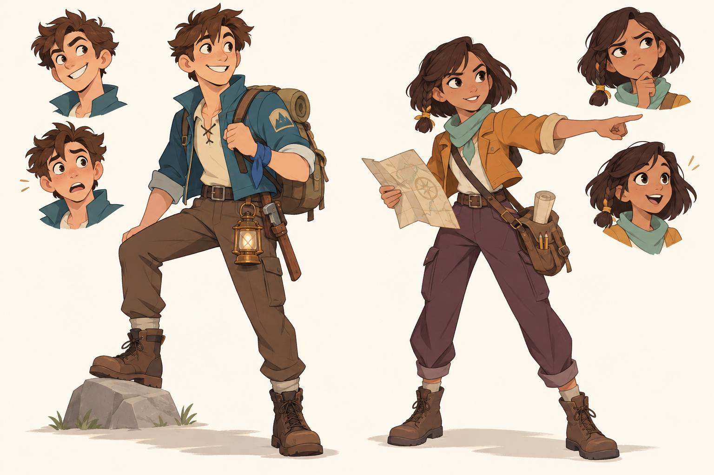

# 캐릭터 시안 · 2026-10-10

## 마음에 들어 한 기본 방향

사용자는 아래의 **젊은 서양 모험 애니메이션풍 남녀 인간 캐릭터**를 좋아했고,
같은 디자인에서 머리가 크거나 비율이 다른 변형을 요청했습니다.
DC 같은 슈퍼히어로풍보다 어린 인상, 선명한 표정과 실용적인 원정 장비가 기준입니다.

- 남자: 헝클어진 갈색 머리, 주근깨와 활기찬 표정, 청록색 재킷, 배낭과 등불.
- 여자: 어두운 단발과 짧은 땋은 머리, 생기 있는 표정, 황토색 재킷, 민트색 스카프와 지도 가방.
- 원정대의 전투·운반·목공·취사라는 생활감은 유지합니다.

## 비율 비교 · 최종 선택 전

| 시안 | 변화 | 이미지 |
| --- | --- | --- |
| A | 머리를 키우면서 모험가의 팔다리 비율을 유지 | [A 보기](proportions/variant-a.png) |
| B | 손·팔뚝·부츠를 강조해 동작이 크게 보이는 실루엣 | [B 보기](proportions/variant-b.png) |
| C | 더 큰 머리, 짧은 팔다리와 둥근 몸 | [C 보기](proportions/variant-c.png) |

A를 기본으로 B의 손발 강조를 조금 섞는 안은 **어시스턴트의 제안**입니다.
사용자는 아직 A/B/C 중 최종 비율을 고르지 않았습니다.
이 문서의 C는 초기 동화풍 방향 C와 별개의 비율 실험입니다.

## 탐색 과정과 생성 프롬프트

| 단계 | 이미지 | 프롬프트 |
| --- | --- | --- |
| 인간·수인·등불 갑옷·곤충 유목민 탐색 | [네 방향](four-directions.png) | [원문](prompt.txt) |
| 같은 네 방향을 만화풍으로 변형 | [만화풍](four-directions-comic.png) | [원문](prompt-comic.txt) |
| 젊은 서양 애니메이션풍 남녀만 제작 · 사용자가 선호한 기준 | [남녀 기본형](western-youth-duo.png) | [원문](prompt-western-youth-duo.txt) |
| 기본 남녀의 비율 변형 A/B/C | 위 비율 비교 표 | [세 변형 원문](proportions/prompts.txt) |

모든 이미지는 이 프로젝트를 위해 내장 image_gen 도구로 생성한 참고 시안입니다.
실제 게임 화면이나 완성된 3D 모델이 아니며 게임 빌드에는 포함하지 않습니다.

## 집에서 이어서 할 작업

현재 게임에는 기존 성인 비율의 `expedition_adult.glb`가 적용되어 있습니다.
이번에는 시안과 프롬프트만 추가했으며 모델·애니메이션·게임 규칙은 변경하지 않았습니다.

1. 최종 신체 비율과 얼굴·의상 방향을 선택합니다.
2. 선택한 남녀의 정면·측면·후면 설정을 맞춥니다.
3. `CharacterView`의 교체 경계를 유지하며 플레이어 모델부터 단계적으로 적용합니다.
4. 이동·공격·회피·양손 도끼·운반 접촉을 확인하고 주민 역할별 변형을 만듭니다.

제작 기준은 [아트 문서](../../../docs/art-pipeline.md), 구현 상태는 [로드맵](../../../docs/roadmap.md)을 참고하세요.
